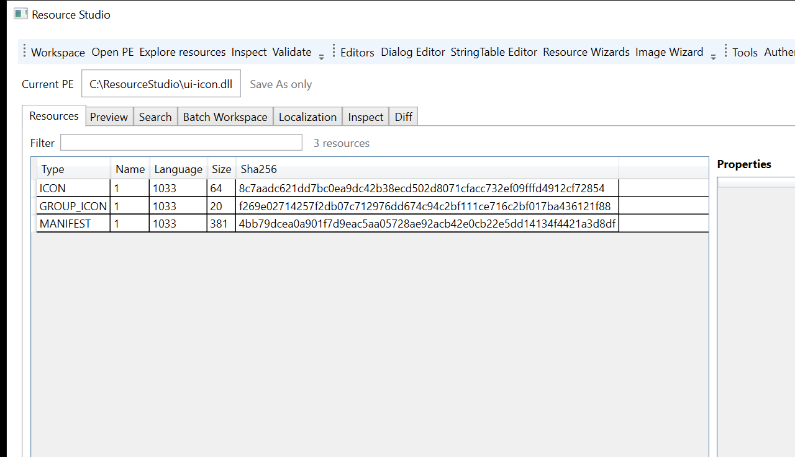

# Resource Studio

**Resource Studio** هو مشروع مستقل لتحليل وتحرير موارد ملفات Windows PE مع أولوية واضحة للصحة القابلة للإثبات، وسلامة `Save As`، وقابلية إعادة الإنتاج. المشروع ليس نسخة مشتقة من Resource Hacker ولا يضمّن `ResourceHacker.exe` أو أي ملف من مجلد تثبيته.

> **قاعدة السلامة الأساسية:** لا يُكتب إلى ملف الإدخال. كل تعديل يمر إلى output جديد، ثم يعاد فتحه ويُفحص قبل commit، مع rollback وaudit عند الحاجة.

## هوية المشروع

المشروع لا يتنافس مع محررات الموارد بإضافة أكبر عدد من الأزرار. هويته الحالية هي **Forensic integrity of PE transformation**: ماذا تغير في الملف، لماذا تغير، وهل نستطيع إثبات أن كل ما عدا التغيير المقصود بقي محفوظًا؟

| المستوى | الهدف |
|---|---|
| **main-goal** | تقوية Resource Studio بمحاذاة Low-Level & Systems Programming: Writer correctness، PE invariants، Windows loader oracle، checksum/signature diagnostics، durable commit، round-trip contracts، corpus، fuzzing، isolation، وWPF process-state reliability |
| **Verification-goal** | جعل Save pipeline قابلًا للتدقيق: `PLAN → MUTATE → SERIALIZE → REOPEN → VALIDATE → DIFF → PRESERVE → WINDOWS → SIGNATURE → COMMIT → AUDIT` |
| **UI/UX-goal** | جعل تجربة الهاوي والمطور مفهومة: Workspace context، Preview، Verification summary، حالة تشغيل واضحة، Save As، accessibility surfaces، وasync Stop |
| **Forensic-goal** | بناء baseline/result evidence، forensic diff، mutation attribution، independent corroboration، وevidence report فوق اللبنات الموجودة، لا كـmodule موازٍ |

## لقطة من الواجهة

هذه لقطة من نسخة Windows بعد فتح fixture عام؛ تعرض Workspace ومسار `Save As only` وفهرس الموارد وSHA-256 لكل مورد. لا تُستخدم اللقطة كبديل عن UI automation أو اختبارات السلوك.



## الحالة الحالية

المشروع في مرحلة **Forensic-goal — baseline/evidence pass**. توجد نواة Python قابلة للاختبار، وCLI JSON، وWPF shell مستقل، وطبقات Verification وUI/UX مطبقة جزئيًا ومختبرة على Manus وWindows في الدورات السابقة.

| المجال | الحالة |
|---|---|
| PE resources | فهرسة وقراءة وتحرير موارد متعددة، مع Manifest وVersionInfo وMenu وStringTable وDialog وBitmap وIcon/Cursor |
| Safe writing | Save As، durable commit، rollback، round-trip، resource invariants، preservation checks، ومنع الكتابة إلى input |
| Verification | Resource Graph، semantic fingerprints، deep PE invariants، differential verification، LIEF comparison، Windows resource oracle، integrity وAuthenticode diagnostics |
| Forensic core | `ForensicBaseline` و`ForensicEvidence` و`verify_transformation` في `core/forensics.py`؛ baseline/result وoperation attribution وforensic difference موثقة ومختبرة جزئيًا |
| Windows shell | WPF مستقل فوق CLI، Verification summary، async CLI runner، Stop، Preview، Image Wizard، وUI automation |
| Testing | اختبارات core/CLI/QA، corpus matrix، bounded وstructure-aware fuzzing، crash consistency، Win32 oracles، Job Object، WPF build وUI automation |
| الوثائق | `CONTRIBUTING.md`، `CHANGELOG.md`، `TODO.md`، وملفات الأهداف والتقارير في `docs/` |

## المسار المفاهيمي

```text
Input PE
   ↓
Forensic baseline
   ↓
Mutation plan / Writer
   ↓
Candidate output
   ↓
Independent reopen and verification
   ├── PE invariants
   ├── Resource Graph
   ├── semantic and structural diff
   ├── preservation evidence
   ├── Windows oracle
   └── checksum / Authenticode
   ↓
Forensic evidence report
   ↓
Durable commit + audit
```

لا يُعتبر Writer مصدر الحقيقة الوحيد. هو ينتج candidate؛ أما الحكم فيُبنى من إعادة الفتح والمقارنة والتحقق المستقل.

## المتطلبات

| المتطلب | الغرض |
|---|---|
| Python 3.12 | النواة وCLI والاختبارات |
| `lief==1.0.0` | قراءة وكتابة PE resources |
| `Pillow>=10.0` | PNG الاختياري في Icon/Cursor payload |
| .NET SDK 8.0 أو أحدث | بناء WPF على Windows |
| Windows 10/11 | Windows oracle وWinVerifyTrust وWPF automation |

لتثبيت .NET استخدم [صفحة .NET 8 الرسمية](https://dotnet.microsoft.com/download/dotnet/8.0). لا تُضمّن SDK أو `ResourceHacker.exe` في المستودع أو الحزم.

## التثبيت والتشغيل

من جذر المشروع:

```bash
python3 -m venv .venv
# Linux/macOS
. .venv/bin/activate
# Windows PowerShell
# .venv\Scripts\Activate.ps1
python -m pip install -r requirements-backend.txt
```

لفحص مورد PE عبر CLI:

```bash
python3 resource_studio_cli.py list tests/fixtures/sample.dll --json
python3 resource_studio_cli.py inspect tests/fixtures/sample.dll --json
python3 resource_studio_cli.py validate tests/fixtures/sample.dll --json
python3 resource_studio_cli.py signature inspect tests/fixtures/sample.dll --json
```

للمشاهدة الخام وRC subset:

```bash
# Hex Viewer على بداية الملف أو على مورد محدد
python3 resource_studio_cli.py hex tests/fixtures/sample.dll --offset 0 --length 128 --json
python3 resource_studio_cli.py hex tests/fixtures/sample.dll --type MANIFEST --name 1 --language 1033 --length 256 --json

# RC subset إلى RES ثم العودة إلى RC
python3 resource_studio_cli.py rc compile sample.rc --output sample.res --language 1033 --json
python3 resource_studio_cli.py rc decompile sample.res --output roundtrip.rc --json
```

يدعم RC compiler/decompiler الحالي `STRINGTABLE` و`MENU/MENUEX` القياسي و`VERSIONINFO`، ويحافظ على الموارد غير المدعومة كتعليقات عند decompile بدل إسقاطها بصمت. لا يدعي أنه بديل كامل لـMicrosoft `rc.exe`؛ التوسعة إلى DIALOG وICON وACCELERATORS ستأتي فقط مع fixtures وعقود round-trip مستقلة.

لعمليات Save As typed resources:

```bash
python3 resource_studio_cli.py manifest-resource export input.dll --language 1033 --output manifest.json --json
python3 resource_studio_cli.py version-resource export input.dll --language 1033 --output version.json --json
python3 resource_studio_cli.py image-payload export input.dll --kind icon --resource-id 1 --language 1033 --output icon-1.bmp --format bmp --json
```

على Windows، ابنِ WPF ثم شغّله:

```powershell
py -3.12 -m pip install --user -r requirements-backend.txt
dotnet restore windows\ResourceStudio.Windows\ResourceStudio.Windows.csproj
dotnet build windows\ResourceStudio.Windows\ResourceStudio.Windows.csproj -c Release
windows\Run-ResourceStudio.cmd
```

## Verification وForensic evidence

يستخدم `core/verification.py` العقود الحالية لبناء Resource Graph وsemantic/layout fingerprints وpreservation map. وتضيف `core/forensics.py` طبقة evidence مستقلة:

```python
from pathlib import Path
from core.forensics import ForensicBaseline, verify_transformation

baseline = ForensicBaseline.from_path(Path("input.dll"))
evidence = verify_transformation(
    Path("input.dll"),
    Path("edited.dll"),
    resource_type="ICON",
    resource_name="1",
    language=1033,
    operation="replace",
    operation_id="operation-14",
).to_dict()
```

ينتج الدليل `resource_studio.forensic_evidence.v1` ويتضمن baseline وresult وtargeted diff وresource-tree unintended changes وPE preservation وbyte-range preservation map وintegrity وRich Header state وsignature وWindows status وpure-loader وraw-parser corroboration وVerificationReport. يحمل الدليل أيضًا chain metadata تشمل `prevSha256` وenvironment fingerprint وcommand line وsha256 قابلًا لإعادة البناء. يرتبط evidence report الآن بـWriteResult وProject/Audit وBatch operation payload، ويُحفظ baseline مستقلًا قبل mutation في artifact ذري يمكن إنشاؤه أيضًا عبر `forensic-baseline`. يميز التقرير بين `passed` لنجاح pipeline و`verified` للتحقق المستقل الكامل، ويعلن `platformLimited` عندما تُتخطى Windows أو Authenticode. تعرض نوافذ WPF طبقة `Technical evidence` من التقرير دون إعادة الحساب داخل الواجهة.

لإنشاء baseline مستقل قبل أي تعديل:

```bash
python3 resource_studio_cli.py forensic-baseline input.dll --output input.forensic-baseline.json --json
```

ولتثبيت evidence في سجل محلي قابل لكشف العبث:

```bash
python3 resource_studio_cli.py evidence-ledger append --ledger evidence.jsonl --input evidence.json --json
python3 resource_studio_cli.py evidence-ledger verify --ledger evidence.jsonl --json
```

ينفذ `durable_commit` أيضًا post-commit readback ويعيد `verifiedSha256` للbytes المقروءة من الهدف بعد الاستبدال. ويثبت Writer determinism regression أن نفس mutation ينتج نفس SHA-256، مع تثبيت COFF timestamp الأصلي بدل تركه يتغير عشوائيًا.

## الاختبارات

بوابة Manus الأساسية:

```bash
python3 -m compileall -q core tests resource_studio_cli.py
for test in tests/core/test_*.py tests/test_cli.py tests/qa/test_*.py; do
  PYTHONPATH=. python3 "$test" || exit 1
done
```

اختبار Forensic الحالي:

```bash
PYTHONPATH=. python3 tests/core/test_forensics.py
```

بوابة Windows الأساسية:

```powershell
$env:PYTHONPATH = (Get-Location).Path
py -3.12 -m compileall -q core tests resource_studio_cli.py
dotnet build windows\ResourceStudio.Windows\ResourceStudio.Windows.csproj -c Release --no-restore
powershell -NoProfile -ExecutionPolicy Bypass -File tests\windows\Invoke-ResourceStudioUIAutomation.ps1 `
  -ApplicationPath windows\ResourceStudio.Windows\bin\Release\net8.0-windows\ResourceStudio.Windows.exe `
  -PePath tests\fixtures\ui-icon.dll
```

لا تُعد المهمة مكتملة لمجرد نجاح build؛ يجب أن يكون الاختبار قابلاً لإعادة التشغيل وأن تُذكر حدود البيئة، خصوصًا Windows-only oracle وMUI/LN وسياسات التوقيع.

## حدود مقصودة

لا يهدف Forensic-goal إلى بناء malware scanner أو IOC engine أو YARA أو PEiD أو entropy maps أو timeline عام أو hex forensic viewer جديد. كما أن MCP مؤجل في هذه الدورة. تُنفذ تغييرات UX فقط عندما تجعل الدليل أو حالة العملية أو accessibility أو reliability أوضح.

تبقى بعض الطبقات قيد التطوير: provenance طويل المدى يربط كل mutation تلقائيًا بledger واحد، تقرير forensic متعدد الصيغ، forensic viewer تفاعلي كامل، raw parser coverage لكل امتدادات PE غير القياسية، coverage-guided fuzzing طويل التشغيل مع corpus دائم، similarity hashing، وF6/TabIndex/screen-reader وfailure/resize matrix الأوسع. لا تُضاف entropy أوssdeep أوTLSH أوrecursive payload analysis لأن ذلك يخرج Forensic-goal إلى malware/steganography analytics خارج النطاق.

## المساهمة والتوثيق

ابدأ بقراءة [`CONTRIBUTING.md`](CONTRIBUTING.md)، ثم [`docs/FORENSIC-GOAL.md`](docs/FORENSIC-GOAL.md)، و[`TODO.md`](TODO.md)، و[`CHANGELOG.md`](CHANGELOG.md). يصف `TODO.md` كل مهمة بمعرّف وحالة ومعيار إنجاز، بينما يسجل `CHANGELOG.md` ما تم تسليمه وما بقي.

## الترخيص والاعتماديات

كود Resource Studio في هذا المستودع مرخص تحت [Apache License 2.0](LICENSE)، ما يسمح بالاستخدام والتعديل وإعادة التوزيع وفق شروط الترخيص، مع بقاء إشعار الحقوق والضمانات والقيود القانونية كما هي في `LICENSE`. هذا توصيف للمستودع وليس استشارة قانونية؛ راجع محاميًا عند دمجه في منتج تجاري أو عند خلطه بكود ذي شروط مختلفة. يعتمد backend PE على [LIEF](https://lief.re/) المرخص تحت Apache-2.0، وتوجد إشعارات الطرف الثالث في [`THIRD-PARTY-NOTICES.md`](THIRD-PARTY-NOTICES.md). ResourceHacker.exe ليس جزءًا من المشروع ولا يُعاد توزيعه، ولا يمنح ترخيص Resource Studio أي حق في أصوله أو علامته أو ملفاته.

## روابط المشروع

- [Forensic-goal](docs/FORENSIC-GOAL.md)
- [Low-Level Systems transition report](docs/LOW_LEVEL_SYSTEMS_TRANSITION_REPORT.md)
- [UI/UX-goal](docs/UIUX-GOAL.md)
- [TODO and execution ledger](TODO.md)
- [Changelog](CHANGELOG.md)
- [Contributing guide](CONTRIBUTING.md)
- [GitHub repository](https://github.com/bio-colab/Resource-Studio)
- [License](LICENSE)
- [Security policy](SECURITY.md)
- [Code of Conduct](CODE_OF_CONDUCT.md)
