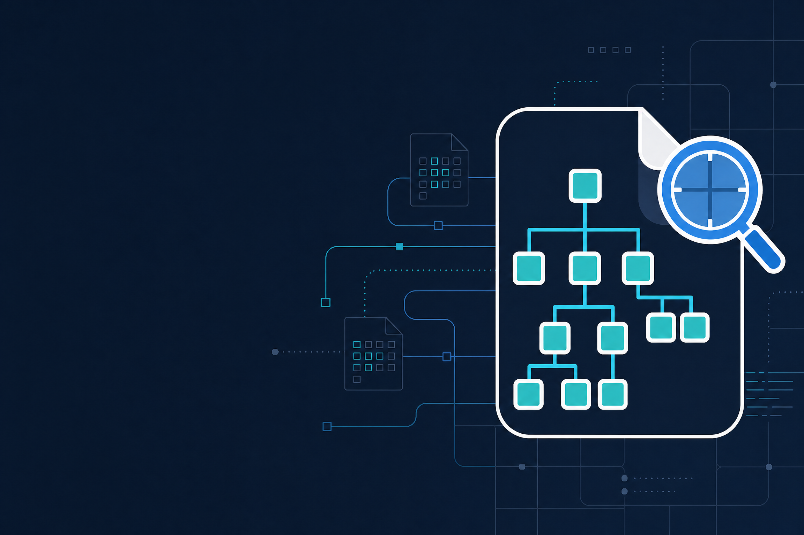
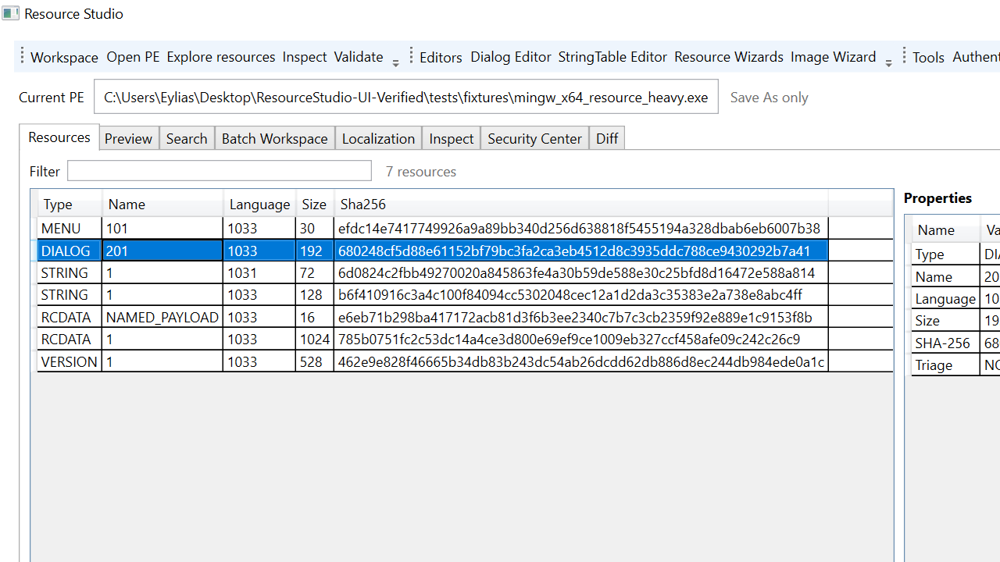
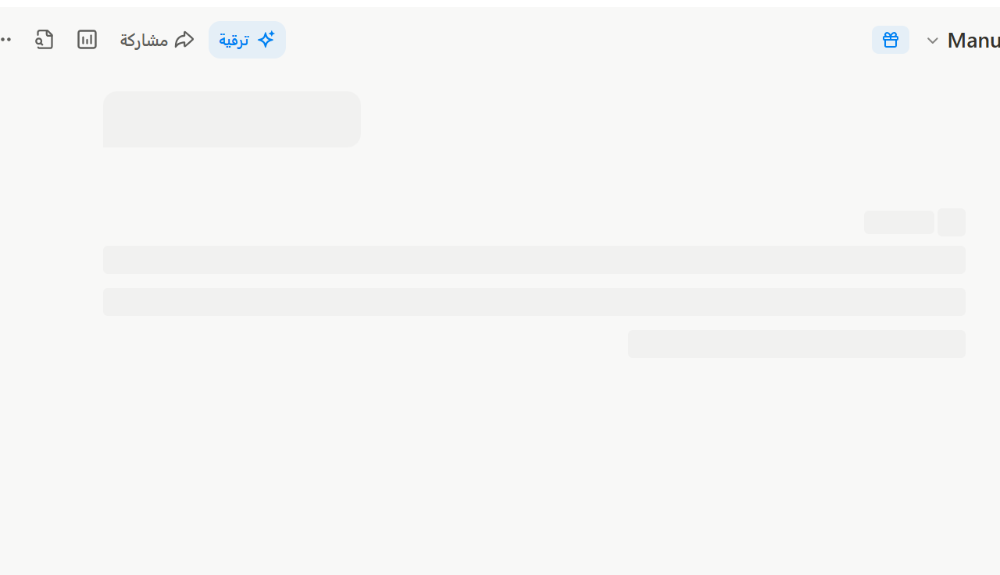

# Resource Studio

**Resource Studio** هو مشروع مستقل لتحليل وتحرير موارد ملفات Windows PE مع أولوية واضحة للصحة القابلة للإثبات، وسلامة `Save As`، وقابلية إعادة الإنتاج.



> **هوية بصرية جديدة:** العلامة والألوان وأصول WPF/Windows موثقة في [`docs/BRAND-IDENTITY.md`](docs/BRAND-IDENTITY.md)، وتُستخدم كإشارة إلى الدقة والتحليل لا كبديل عن نتائج التحقق.

> **قاعدة السلامة الأساسية:** لا يُكتب إلى ملف الإدخال. كل تعديل يمر إلى output جديد، ثم يعاد فتحه ويُفحص قبل commit، مع rollback وaudit عند الحاجة.

## هوية المشروع

المشروع لا يتنافس مع محررات الموارد بإضافة أكبر عدد من الأزرار. هويته الحالية هي **Forensic integrity of PE transformation**: ماذا تغير في الملف، لماذا تغير، وهل نستطيع إثبات أن كل ما عدا التغيير المقصود بقي محفوظًا؟

| المستوى | الهدف |
|---|---|
| **main-goal** | تقوية Resource Studio بمحاذاة Low-Level & Systems Programming: Writer correctness، PE invariants، Windows loader oracle، checksum/signature diagnostics، durable commit، round-trip contracts، corpus، fuzzing، isolation، وWPF process-state reliability |
| **Verification-goal** | جعل Save pipeline قابلًا للتدقيق: `PLAN → MUTATE → SERIALIZE → REOPEN → VALIDATE → DIFF → PRESERVE → WINDOWS → SIGNATURE → COMMIT → AUDIT` |
| **UI/UX-goal** | جعل تجربة الهاوي والمطور مفهومة: Workspace context، Preview، Verification summary، حالة تشغيل واضحة، Save As، accessibility surfaces، وasync Stop |
| **Forensic-goal** | بناء baseline/result evidence، forensic diff، mutation attribution، independent corroboration، وevidence report فوق اللبنات الموجودة، لا كـmodule موازٍ |

### لغة الواجهة

تعتمد WPF shell على لوحة داكنة هادئة مع **Signal Cyan** للإجراءات القابلة للتنفيذ، و**Analysis Blue** للتحليل، و**Triage Amber** للتنبيه، و**Evidence Red** للإشارة البصرية إلى ما يحتاج مراجعة. هذه الألوان لا تصدر verdict أمنيًا؛ بل تساعد المستخدم على فهم الحالة قبل فتح التفاصيل التقنية.

## لقطة من الواجهة

هذه لقطة من نسخة Windows بعد فتح fixture عام؛ تعرض Workspace ومسار `Save As only` وفهرس الموارد وSHA-256 لكل مورد. لا تُستخدم اللقطة كبديل عن UI automation أو اختبارات السلوك.


## الحالة الحالية

المشروع في مرحلة **Forensic-goal — baseline/evidence pass**. توجد نواة Python قابلة للاختبار، وCLI JSON، وWPF shell مستقل، وطبقات Verification وUI/UX مطبقة جزئيًا ومختبرة على Manus وWindows في الدورات السابقة.

| المجال | الحالة |
|---|---|
| PE resources | فهرسة وقراءة وتحرير موارد متعددة، مع Manifest وVersionInfo وMenu وStringTable وDialog وBitmap وIcon/Cursor |
| Safe writing | Save As، durable commit، rollback، round-trip، resource invariants، preservation checks، ومنع الكتابة إلى input |
| Verification | Resource Graph، semantic fingerprints، deep PE invariants، differential verification، LIEF comparison، Windows resource oracle، integrity وAuthenticode diagnostics |
| Forensic core | `ForensicBaseline` و`ForensicEvidence` و`verify_transformation` في `core/forensics.py`؛ baseline/result وoperation attribution وforensic difference موثقة ومختبرة جزئيًا |
| Security Layer | static PE report، unpacking indicators، bounded Capstone disassembly وCFG، hex templates في Preview، وvisual evidence triage مع import-only behavioral telemetry/memory/API evidence وtarget SHA-256 |
| Windows shell | WPF مستقل فوق CLI، Verification summary، async CLI runner، Stop، Preview مع field-to-byte hex selection، Resource Grid triage coloring، Image Wizard، وثيم داكن موحد للنوافذ الفرعية، وUI automation؛ مع تحسينات وإصلاحات P0 لمسارات DLLs الواقعية وSave As diagnostics |
| Testing | اختبارات core/CLI/QA، PE corpus matrix متعدد المعمارية والprofiles، bounded وstructure-aware fuzzing، crash consistency، Win32 oracles، Job Object، WPF build وUI automation |
| الوثائق | `CONTRIBUTING.md`، `CHANGELOG.md`، `TODO.md`، وملفات الأهداف والتقارير في `docs/`، ومنها [`docs/PE-CORPUS.md`](docs/PE-CORPUS.md) |

## لقطة WPF محلية

توضح اللقطة التالية نسخة WPF المبنية والمشغلة على Windows المحلي مع طبقة Preview/triage الجديدة:



توضح اللقطة التالية build Windows المحلي بعد تطبيق العلامة والأيقونة ولوحة الألوان الجديدة:



تطبق النافذة الرئيسية والنوافذ الفرعية موارد الثيم نفسها؛ وتبقى مساحة Dialog البيضاء داخل Dialog Editor مقصودة لأنها تمثل سطح الحوار المصمم، لا سطح التطبيق.

## المسار المفاهيمي

```text
Input PE
   ↓
Forensic baseline
   ↓
Mutation plan / Writer
   ↓
Candidate output
   ↓
Independent reopen and verification
   ├── PE invariants
   ├── Resource Graph
   ├── semantic and structural diff
   ├── preservation evidence
   ├── Windows oracle
   └── checksum / Authenticode
   ↓
Forensic evidence report
   ↓
Durable commit + audit
```

لا يُعتبر Writer مصدر الحقيقة الوحيد. هو ينتج candidate؛ أما الحكم فيُبنى من إعادة الفتح والمقارنة والتحقق المستقل.

## المتطلبات

| المتطلب | الغرض |
|---|---|
| Python 3.12 | النواة وCLI والاختبارات |
| `lief==1.0.0` | قراءة وكتابة PE resources |
| `Pillow>=10.0` | PNG الاختياري في Icon/Cursor payload |
| `capstone>=5.0,<6` | bounded static disassembly وCFG من PE entrypoint |
| .NET SDK 8.0 أو أحدث | بناء WPF على Windows |
| Windows 10/11 | Windows oracle وWinVerifyTrust وWPF automation |

لتثبيت .NET استخدم [صفحة .NET 8 الرسمية](https://dotnet.microsoft.com/download/dotnet/8.0) عند البناء من المصدر. لا يُضمّن SDK أو أدوات البناء داخل المستودع؛ أما حزمة Windows الرسمية فتحتوي executable التطبيق وCLI المحمول الناتجين من عملية البناء.

## التثبيت والتشغيل

### Windows installer

للمستخدمين على Windows، تتوفر حزمة `ResourceStudio-0.1.0-win-x64-installer.zip` داخل GitHub Release. فك الضغط ثم شغّل `ResourceStudio-Setup-0.1.0-win-x64.exe`. يعرض installer اتفاقية الاستخدام المبنية على Apache License 2.0، ويستخدم أيقونة Resource Studio وهوية الألوان الحالية، ويثبت التطبيق افتراضيًا داخل مجلد المستخدم دون الحاجة إلى صلاحيات administrator.

الحزمة self-contained: فهي تحتوي WPF shell منشورًا لـ`win-x64` وCLI محمولًا، ولا تتطلب تثبيت Python أو .NET Runtime منفصلًا. بعد التثبيت سيجد المستخدم اختصار Resource Studio وملفَي `EULA.txt` و`INSTALLATION.txt`. يجب التحقق من SHA-256 المنشور في [تقرير إصدار Windows](docs/RELEASE-WINDOWS-0.1.0.md) قبل التشغيل.

### البناء من المصدر

من جذر المشروع:

```bash
python3 -m venv .venv
# Linux/macOS
. .venv/bin/activate
# Windows PowerShell
# .venv\Scripts\Activate.ps1
python3 -m pip install -r requirements-backend.txt
# optional corpus rebuild tools on Debian/Ubuntu: MinGW-w64, UPX, OpenSSL, osslsigncode
```

لفحص مورد PE عبر CLI:

```bash
python3 resource_studio_cli.py list tests/fixtures/sample.dll --json
python3 resource_studio_cli.py inspect tests/fixtures/sample.dll --json
python3 resource_studio_cli.py validate tests/fixtures/sample.dll --json
python3 resource_studio_cli.py signature inspect tests/fixtures/sample.dll --json
```

للمشاهدة الخام وRC subset:

```bash
# Hex Viewer على بداية الملف أو على مورد محدد
python3 resource_studio_cli.py hex tests/fixtures/sample.dll --offset 0 --length 128 --json
python3 resource_studio_cli.py hex tests/fixtures/sample.dll --type MANIFEST --name 1 --language 1033 --length 256 --json

# RC subset إلى RES ثم العودة إلى RC
python3 resource_studio_cli.py rc compile sample.rc --output sample.res --language 1033 --json
python3 resource_studio_cli.py rc decompile sample.res --output roundtrip.rc --json
```

يدعم RC compiler/decompiler الحالي `STRINGTABLE` و`MENU/MENUEX` القياسي و`VERSIONINFO`، ويحافظ على الموارد غير المدعومة كتعليقات عند decompile بدل إسقاطها بصمت. لا يدعي أنه بديل كامل لـMicrosoft `rc.exe`؛ التوسعة إلى DIALOG وICON وACCELERATORS ستأتي فقط مع fixtures وعقود round-trip مستقلة.

لعمليات Save As typed resources:

```bash
python3 resource_studio_cli.py manifest-resource export input.dll --language 1033 --output manifest.json --json
python3 resource_studio_cli.py version-resource export input.dll --language 1033 --output version.json --json
python3 resource_studio_cli.py image-payload export input.dll --kind icon --resource-id 1 --language 1033 --output icon-1.bmp --format bmp --json
```

على Windows، ابنِ WPF ثم شغّله:

```powershell
py -3.12 -m pip install --user -r requirements-backend.txt
dotnet restore windows\ResourceStudio.Windows\ResourceStudio.Windows.csproj
dotnet build windows\ResourceStudio.Windows\ResourceStudio.Windows.csproj -c Release
windows\Run-ResourceStudio.cmd
```

واجهة Windows المدعومة هي **WPF shell** الموجودة في `windows/ResourceStudio.Windows/`، لأنها تعرض مسارات التحقق والمعاينة والمحررات typed الخاصة بالمشروع. يبقى `resource_studio_gui.py` كواجهة **Tkinter fallback/legacy** خفيفة للبيئات التي لا تستطيع تشغيل WPF؛ وهي مناسبة للفهرسة والعرض الأساسي، لكنها لا تمثل كامل سطح Verification أو Forensic أو المحررات typed.

## Verification وForensic evidence

يستخدم `core/verification.py` العقود الحالية لبناء Resource Graph وsemantic/layout fingerprints وpreservation map. وتضيف `core/forensics.py` طبقة evidence مستقلة:

```python
from pathlib import Path
from core.forensics import ForensicBaseline, verify_transformation

baseline = ForensicBaseline.from_path(Path("input.dll"))
evidence = verify_transformation(
    Path("input.dll"),
    Path("edited.dll"),
    resource_type="ICON",
    resource_name="1",
    language=1033,
    operation="replace",
    operation_id="operation-14",
).to_dict()
```

ينتج الدليل `resource_studio.forensic_evidence.v1` ويتضمن baseline وresult وtargeted diff وresource-tree unintended changes وPE preservation وbyte-range preservation map وintegrity وRich Header state وsignature وWindows status وpure-loader وraw-parser corroboration وVerificationReport. يحمل الدليل أيضًا chain metadata تشمل `prevSha256` وenvironment fingerprint وcommand line وsha256 قابلًا لإعادة البناء. يرتبط evidence report الآن بـWriteResult وProject/Audit وBatch operation payload، ويُحفظ baseline مستقلًا قبل mutation في artifact ذري يمكن إنشاؤه أيضًا عبر `forensic-baseline`. يميز التقرير بين `passed` لنجاح pipeline و`verified` للتحقق المستقل الكامل، ويعلن `platformLimited` عندما تُتخطى Windows أو Authenticode. تعرض نوافذ WPF طبقة `Technical evidence` من التقرير دون إعادة الحساب داخل الواجهة.

يضيف `core/evidence_model.py` صيغة `resource_studio.evidence_summary.v1` التي تطبع observations مع المصدر والمحلل وconfidence و`rawRange`، وتعرض إحصاءات الموارد ونتائج corroboration وExpert Findings مع limitations. أمر `inspect --json` يعيد هذه الطبقة في `evidence` ويضيف `evidenceHash` ثابتًا للمقارنة، كما يضمّنها `ForensicEvidence`. التفاصيل والحدود في [`docs/PE-EVIDENCE-MODEL.md`](docs/PE-EVIDENCE-MODEL.md).

لإنشاء baseline مستقل قبل أي تعديل:

```bash
python3 resource_studio_cli.py forensic-baseline input.dll --output input.forensic-baseline.json --json
```

ولتثبيت evidence في سجل محلي قابل لكشف العبث:

```bash
python3 resource_studio_cli.py evidence-ledger append --ledger evidence.jsonl --input evidence.json --json
python3 resource_studio_cli.py evidence-ledger verify --ledger evidence.jsonl --json
```

لعمليات batch القابلة للاستئناف:

```bash
python3 resource_studio_cli.py batch plan batch.json --json
python3 resource_studio_cli.py batch apply batch.json --journal batch.journal.jsonl --report batch-report.json --json
python3 resource_studio_cli.py batch apply batch.json --journal batch.journal.jsonl --resume --json
```

ولإنشاء تقرير before/after مفهوم بعد الكتابة:

```bash
python3 resource_studio_cli.py report diagnostics before.dll after.dll --format markdown --output diagnostics.md
python3 resource_studio_cli.py security sample.dll --json
python3 resource_studio_cli.py security sample.dll --external-result defender-result.json --json
python3 resource_studio_cli.py security sample.dll --stage-root ./security-staging --ledger ./security-ledger.jsonl --json
# runtime evidence imported from external tools; Resource Studio never executes the PE
python3 resource_studio_cli.py security sample.dll --behavioral-telemetry process-trace.json --memory-evidence memory-report.json --api-trace api-trace.json --json
python3 resource_studio_cli.py evidence-graph sample.dll --json
python3 resource_studio_cli.py evidence-query sample.dll 'resource.type == "MANIFEST" and resource.size >= 0' --json
python3 resource_studio_cli.py case create sample.dll --output sample.case.json --json
python3 resource_studio_cli.py case analyze sample.case.json sample.dll --json
python3 resource_studio_cli.py report security sample.dll --format markdown --output security.md
```

توثّق [`docs/PRODUCTIZATION.md`](docs/PRODUCTIZATION.md) عقود journal/resume وPost-write Diagnostics وحدود المرحلة التالية. وتوثّق [`docs/SECURITY-GOAL.md`](docs/SECURITY-GOAL.md) عقد `external_scan.v1`؛ الخيار `--external-result` يستورد JSON موجودًا ولا يشغّل الموفر، بينما `--stage-root` ينشئ نسخة read-only و`--ledger` يربط التقرير بسجل EvidenceLedger محلي. وتشرح [`docs/ADVANCED-EVIDENCE-DESIGN.md`](docs/ADVANCED-EVIDENCE-DESIGN.md) عقود graph/query/case، وتشرح [`docs/STATIC-CODE-ANALYSIS.md`](docs/STATIC-CODE-ANALYSIS.md) disassembly وCFG وruntime evidence boundaries. تعرض WPF Security Center هذه الطبقات فوق CLI دون إعادة تنفيذ Verification Engine.

ينفذ `durable_commit` أيضًا post-commit readback ويعيد `verifiedSha256` للbytes المقروءة من الهدف بعد الاستبدال. ويثبت Writer determinism regression أن نفس mutation ينتج نفس SHA-256، مع تثبيت COFF timestamp الأصلي بدل تركه يتغير عشوائيًا.

## الاختبارات

بوابة Manus الأساسية:

```bash
python3 -m compileall -q core tests resource_studio_cli.py
for test in tests/core/test_*.py tests/test_cli.py tests/qa/test_*.py; do
  PYTHONPATH=. python3 "$test" || exit 1
done
```

اختبار Forensic الحالي:

```bash
PYTHONPATH=. python3 tests/core/test_forensics.py
```

بوابة Windows الأساسية:

```powershell
$env:PYTHONPATH = (Get-Location).Path
py -3.12 -m compileall -q core tests resource_studio_cli.py
dotnet build windows\ResourceStudio.Windows\ResourceStudio.Windows.csproj -c Release --no-restore
powershell -NoProfile -ExecutionPolicy Bypass -File tests\windows\Invoke-ResourceStudioUIAutomation.ps1 `
  -ApplicationPath windows\ResourceStudio.Windows\bin\Release\net8.0-windows\ResourceStudio.Windows.exe `
  -PePath tests\fixtures\ui-icon.dll
```

لا تُعد المهمة مكتملة لمجرد نجاح build؛ يجب أن يكون الاختبار قابلاً لإعادة التشغيل وأن تُذكر حدود البيئة، خصوصًا Windows-only oracle وMUI/LN وسياسات التوقيع.

## قياس الأداء P0

يحتوي المشروع على telemetry اختيارية لمسارات القراءة والكتابة وWPF runner. لا تعمل هذه الطبقة افتراضيًا ولا تغير المخرجات أو قرارات التحقق؛ لتفعيلها استخدم متغير البيئة `RESOURCE_STUDIO_P0_TELEMETRY_PATH`، ثم شغّل baseline:

```bash
P0_BASELINE_OUTPUT=/tmp/resource-studio-p0-baseline.json \\
PYTHONPATH=. python3 tools/p0_baseline.py
```

يعرض التقرير زمن العملية الخارجية، وزمن داخل CLI، وعدد LIEF parses والقراءات الكاملة والملفات والمجلدات المؤقتة والعمليات الفرعية. النتائج الموثقة للعينة الحالية موجودة في [`docs/P0-PERFORMANCE-BASELINE.md`](docs/P0-PERFORMANCE-BASELINE.md)، مع التنبيه إلى أن زمن process startup في بيئة القياس ليس latency التطبيق الفعلية على Windows.

أُنجز P1 عبر [`core/resource_reader.py`](core/resource_reader.py): تستخدم `list` و`extract` و`search` وقراءة طرفي `diff` parse واحدًا دون إنشاء `Project` أو workspace أو audit. على fixture baseline نفسه أصبحت هذه المسارات عند `temporaryDirectories=0` و`temporaryFiles=0` و`fullFileReads=0`. لا يشمل P1 Writer أو Verification Engine أو resource mode في `hex`; التفاصيل في [`docs/P1-READONLY-READER.md`](docs/P1-READONLY-READER.md).

أُنجز P2 عبر `VerificationContext`: يعيد Writer استخدام binary وsnapshot وResourceGraph وdeep/integrity/signature بين مراحل التحقق، مع بقاء pre-commit وpost-commit وforensic gates. على نفس fixture انخفض `writer.replace_manifest` من 49 إلى 11 LIEF parses ومن 14 إلى 12 full reads؛ التفاصيل في [`docs/P2-VERIFICATION-CONTEXT.md`](docs/P2-VERIFICATION-CONTEXT.md).

أُنجز P3 عبر [`tools/wpf_read_host.py`](tools/wpf_read_host.py) و`ReadHostClient.cs`: تستخدم MainWindow عملية Python طويلة العمر عبر JSONL لمسارات القراءة الساخنة، مع session cache لـ`list/search` وfallback للمسار القديم عند الحاجة. على fixture baseline كان `search` الدافئ 8.177ms داخل host مقابل 467.936ms لتشغيل CLI مستقل في بيئة Linux؛ هذه مقارنة process startup وليست benchmark Windows. لا ينقل P3 core إلى Rust أو C++ قبل قياس Windows يثبت الحاجة؛ التفاصيل في [`docs/P3-READ-HOST.md`](docs/P3-READ-HOST.md).

أُنجز P4 بإضافة `_requestGeneration` و`CliResult.IsStale`: عند بدء طلب أحدث يُلغى السابق، ولا يستطيع ناتج قديم الكتابة إلى UI. كما أصبحت عملية fallback مملوكة للطلب الذي أنشأها، وتفاصيل ذلك في [`docs/P4-WPF-SESSION.md`](docs/P4-WPF-SESSION.md).

أُجري تقييم Rust جراحيًا على byte-search عبر FFI. تطابقت النتائج مع Python، لكن `bytes.find` كان أسرع، لذلك لم يُدخل المشروع dependency أو native artifact غير مبرر. النتيجة والتجربة في [`docs/RUST-EVALUATION.md`](docs/RUST-EVALUATION.md).

بعد مراجعة أنماط Wireshark وOxygen Forensic Detective، أضيفت annotations append-only إلى case مع `artifactSha256` و`graphHash` وactor وUTC timestamp، وأضيف `case annotate` و`case select` لتصدير `evidence_selection.v1` انتقائيًا. تعرض Security Center controls الأساسية لذلك دون تعديل PE؛ الدراسة والمقارنة في [`docs/FORENSIC-ANALYTICS-RESEARCH.md`](docs/FORENSIC-ANALYTICS-RESEARCH.md).

أصبحت DIALOG وMENU محررين typed فعليًا: Dialog Editor يعرض BUTTON وEDIT وSTATIC وLISTBOX وCOMBOBOX، ويتيح تعديل IDs والـclass والـstyle والـexstyle والهندسة والنص وإضافة/حذف/نسخ controls. ويتيح Menu Editor تعديل IDs والنصوص وflags، وإضافة root/child/separator، والحذف وإعادة الترتيب والتحقق من duplicate IDs. يدعم CLI أيضًا `dialog validate` و`menu-resource validate` قبل Apply Save As؛ التفاصيل في [`docs/DIALOG-MENU-EDITOR.md`](docs/DIALOG-MENU-EDITOR.md).

## حدود مقصودة

لا يهدف Forensic-goal إلى بناء malware scanner أو IOC engine أو YARA أو PEiD أو entropy maps أو timeline عام أو hex forensic viewer جديد. أصبح Security-goal مسارًا مستقلًا للتحليل الساكن الدفاعي؛ لا يشغّل الملفات ولا يفك payloadات ولا يعلن أن heuristic واحدة تعني malware. أما Defender وYARA فهما موفّران خارجيان اختياريان على staged copies، وليسَا جزءًا من writer أو verdict داخلي. كما أن MCP مؤجل في هذه الدورة.

تبقى بعض الطبقات قيد التطوير: provenance طويل المدى يربط كل mutation تلقائيًا بledger واحد، تقرير forensic متعدد الصيغ، forensic viewer تفاعلي كامل، raw parser coverage لكل امتدادات PE غير القياسية، coverage-guided fuzzing طويل التشغيل مع corpus دائم، similarity hashing، وF6/TabIndex/screen-reader وfailure/resize matrix الأوسع. لا تُضاف entropy أوssdeep أوTLSH أوrecursive payload analysis لأن ذلك يخرج Forensic-goal إلى malware/steganography analytics خارج النطاق.

## المساهمة والتوثيق

ابدأ بقراءة [`CONTRIBUTING.md`](CONTRIBUTING.md)، ثم [`docs/FORENSIC-GOAL.md`](docs/FORENSIC-GOAL.md)، و[`docs/SECURITY-GOAL.md`](docs/SECURITY-GOAL.md)، و[`TODO.md`](TODO.md)، و[`CHANGELOG.md`](CHANGELOG.md). يصف `TODO.md` كل مهمة بمعرّف وحالة ومعيار إنجاز، بينما يسجل `CHANGELOG.md` ما تم تسليمه وما بقي.

## الترخيص والاعتماديات

كود Resource Studio في هذا المستودع مرخص تحت [Apache License 2.0](LICENSE)، ما يسمح بالاستخدام والتعديل وإعادة التوزيع وفق شروط الترخيص، مع بقاء إشعار الحقوق والضمانات والقيود القانونية كما هي في `LICENSE`. هذا توصيف للمستودع وليس استشارة قانونية؛ راجع محاميًا عند دمجه في منتج تجاري أو عند خلطه بكود ذي شروط مختلفة. يعتمد backend PE على [LIEF](https://lief.re/) المرخص تحت Apache-2.0، وتوجد إشعارات الطرف الثالث في [`THIRD-PARTY-NOTICES.md`](THIRD-PARTY-NOTICES.md). external executable ليس جزءًا من المشروع ولا يُعاد توزيعه، ولا يمنح ترخيص Resource Studio أي حق في أصوله أو علامته أو ملفاته.

## روابط المشروع

- [Forensic-goal](docs/FORENSIC-GOAL.md)
- [Low-Level Systems transition report](docs/LOW_LEVEL_SYSTEMS_TRANSITION_REPORT.md)
- [UI/UX-goal](docs/UIUX-GOAL.md)
- [TODO and execution ledger](TODO.md)
- [PE Evidence model](docs/PE-EVIDENCE-MODEL.md)
- [Productization backlog](docs/PRODUCTIZATION.md)
- [Security-goal](docs/SECURITY-GOAL.md)
- [Changelog](CHANGELOG.md)
- [Contributing guide](CONTRIBUTING.md)
- [GitHub repository](https://github.com/bio-colab/Resource-Studio)
- [License](LICENSE)
- [Security policy](SECURITY.md)
- [Code of Conduct](CODE_OF_CONDUCT.md)
- [GitHub foundation](docs/GITHUB-FOUNDATION.md)
- [Community starter issue #1](https://github.com/bio-colab/Resource-Studio/issues/1)
