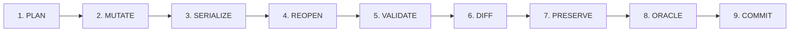

# Resource Studio ⌁
### Next-Generation Win32 PE Resource Workbench & Automation Pipeline

[](https://github.com/bio-colab/Resource-Studio/actions/workflows/ci.yml)
[](https://github.com/bio-colab/Resource-Studio)
[](https://www.python.org/)
[](https://dotnet.microsoft.com/)
[](LICENSE)
[](ABOUT.md)

---


> **Resource Studio** is a provably safe, modern, and lightning-fast PE (Portable Executable) resource analysis and editing workbench. Engineered from the ground up as the 21st-century replacement for legacy Win32 tools like **Resource Hacker**, it combines a high-performance Python 3.12 headless engine with an ergonomic .NET 8 WPF shell, strict binary preservation invariants, and declarative CI/CD patch automation.

---

## 🌟 لماذا Resource Studio؟ (The Marketing & Value Proposition)

لعقود طويلة، اعتمد مجتمع الهندسة العكسية، مطورو النظم، ومترجمو البرمجيات على أدوات ويندوز القديمة مثل **Resource Hacker** و **PE Explorer**. ورغم ريادتها في تسعينيات القرن الماضي، إلا أنها باتت تشكل **خطراً حقيقياً** في بيئات الإنتاج الحديثة:

1. **خطر إتلاف الملفات التنفيذية (In-Place Overwrite Catastrophe):** الأدوات القديمة تكتب مباشرة فوق الملف الأصلي، مما يؤدي إلى تشويه جداول الـ Relocations، كسر محاذاة الأقسام (Section Alignment)، وإلغاء التوقيعات الرقمية (Authenticode) بدون تحذير.
2. **غياب التحقق الرياضي (Zero Verification):** لا يوجد أي فحص مستقل لسلامة الملف قبل اعتماده. مجرد خطأ في بايت واحد يجعل الملف التنفيذي غير قابل للإقلاع (`Crash on Launch`).
3. **انعدام الأتمتة في خطوط الإنتاج (No CI/CD):** أدوات تقليدية مغلقة داخل واجهات رسومية عتيقة، تستحيل أتمتتها في خطوط الـ DevOps أو تشغيلها داخل خوادم الـ Linux.
4. **واجهات قديمة تفتقر للتباين:** مشاكل مستمرة في التباين اللوني، اقتطاع النصوص في الشاشات الحديثة، وغياب أي ذكاء لتوطين الحوارات.

### جدول المقارنة الشامل (The Competitive Matrix)

| الميزة / المعيار | Resource Studio (v2.0) | Resource Hacker | PE Explorer | CFF Explorer |
| :--- | :---: | :---: | :---: | :---: |
| **ضمان السلامة المطلق (Save As Only)** | ✅ **صارم ومدعوم بالـ Rollback** | ❌ يكتب فوق الأصل | ❌ يكتب فوق الأصل | ❌ يكتب فوق الأصل |
| **دورة التحقق التلقائية (9-Stage Verification)** | ✅ **فحص شامل ومستقل** | ❌ لا يوجد | ❌ لا يوجد | ❌ لا يوجد |
| **أتمتة الوصفات لـ CI/CD (`recipe apply`)** | ✅ **نظام وصفات JSON مؤتمت** | ❌ لا يوجد | ❌ لا يوجد | ❌ نصوص محدودة |
| **كاشف قص النصوص (Text Clipping Detector)** | ✅ **حساب ذكي بوحدات DLU** | ❌ لا يوجد | ❌ لا يوجد | ❌ لا يوجد |
| **محاكاة التعريب الزائف (Pseudo-Localization)** | ✅ **توسيع النصوص بلمسة واحدة** | ❌ لا يوجد | ❌ لا يوجد | ❌ لا يوجد |
| **معاينة المرآة للغات اليمين لليسار (RTL Mirror)** | ✅ **دعم حقيقي للعربية والعبرية** | ❌ لا يوجد | ❌ لا يوجد | ❌ لا يوجد |
| **مولدات الأكواد (C/C++ Array, C# Span, Base64)** | ✅ **نسخ فوري لكافة اللغات** | ❌ لا يوجد | ❌ لا يوجد | ❌ لا يوجد |
| **توليد ملف الرأس Win32 `resource.h`** | ✅ **توليد قياسي متوافق مع VS** | ❌ محدود | ❌ لا يوجد | ❌ لا يوجد |
| **كشف تسريب مسار PDB (Binary Forensics)** | ✅ **كشف وتنبيه ونسخ فوري** | ❌ لا يوجد | ❌ عرض فقط | ❌ عرض فقط |
| **فحص تراكب الـ PE (Trailing Overlay Inspector)** | ✅ **حماية الحمولات الإضافية** | ❌ لا يوجد | ⚠️ جزئي | ⚠️ جزئي |
| **نظام التباين اللوني القياسي (WCAG AAA)** | ✅ **تباين يتجاوز 15:1** | ❌ واجهة ويندوز قديمة | ❌ واجهة كلاسيكية | ❌ واجهة كلاسيكية |
| **دعم الأنظمة المشتركة (Cross-Platform CLI)** | ✅ **Linux & Windows CLI** | ❌ Windows فقط | ❌ Windows فقط | ❌ Windows فقط |

---

## 🚀 القدرات الخارقة للمشروع (Core Superpowers)

### 1. ضمان السلامة الرياضية وقاعدة "Save As Only"
لا يقوم Resource Studio بالكتابة على ملف الإدخال إطلاقاً. تمر أي عملية تعديل عبر دورة تحقق مستقلة من 9 مراحل:

```mermaid
flowchart LR
    P1["1. PLAN"] --> P2["2. MUTATE"]
    P2 --> P3["3. SERIALIZE"]
    P3 --> P4["4. REOPEN"]
    P4 --> P5["5. VALIDATE"]
    P5 --> P6["6. DIFF"]
    P6 --> P7["7. PRESERVE"]
    P7 --> P8["8. ORACLE"]
    P8 --> P9["9. COMMIT"]
```
* **PLAN:** التحقق من عقد التعديل وإحداثيات المورد.
* **MUTATE:** تطبيق التغيير في الذاكرة عبر LIEF.
* **SERIALIZE:** حفظ الملف المرشح في مساحة عزل مؤقتة (Sandbox).
* **REOPEN:** إعادة قراءة وفحص الملف المرشح من القرص بشكل مستقل.
* **VALIDATE:** التأكد من صحة هندسة الـ PE، المحاذاة، وفهارس الموارد.
* **DIFF:** مقارنة البصمات الدلالية والتأكد من مطابقة التغيير المستهدف فقط.
* **PRESERVE:** التأكد من تطابق كافة الأقسام البرمجية والتصدير والاستيراد وTLS وDebug بنسبة 100%.
* **ORACLE:** استدعاء أوراكل كيرنل ويندوز الحقيقي (`LoadLibraryExW`) للتحقق من قبول النظام للملف.
* **COMMIT:** استبدال ذري آمن للملف الجديد (`ReplaceFileW`) دون لمس الأصل.

### 2. ذكاء الحوارات والتوطين (Dialog & Localization Intelligence)
* **كاشف قص النصوص (Text Clipping Detector):** يحسب الحجم التقديري المطلوب للنصوص بوحدات DLU (Dialog Units) ويقارنها بأبعاد كل عنصر تحكم؛ منبهاً المترجم والمطور فوراً عند وجود خطر لاقتطاع النص.
* **التعريب الزائف (Pseudo-Localization):** يوسع النصوص بنسبة 30% مع تحويل المحارف إلى رموز بصرية مطابقة وعريضة مثل `［...］` لاختبار صمود التصميم قبل ترجمته.
* **معاينة المرآة (RTL Mirroring):** يعكس تموضع عناصر الحوار أفقياً لمحاكاة مظهر الواجهة عند تشغيلها باللغة العربية أو العبرية.

### 3. النظافة الجنائية للملفات الثنائية (Binary Hygiene & Forensics)
* **كشف تسريب مسار PDB:** يستخرج مسار ملف التصحيح من سجلات CodeView Debug في الـ PE، وينبه المستخدم في حال تسريب المسارات الشخصية لبيئة المطور مع إمكانية نسخ المسار بنقرة واحدة.
* **تشخيص التراكب (Trailing Overlay):** يحلل البيانات الملحقة بعد آخر قسم PE للتأكد من عدم ضياع أي توقيعات أو حمولات مشفرة.

### 4. مولدات الأكواد السريعة للمطورين (Developer Micro-Generators)
بنقرة زر أيمن على أي مورد في جدول الموارد، يمكنك فورياً:
* **Copy as C/C++ Array:** تصدير المورد كمصفوفة بايتات نقية (`const unsigned char res_...[]`).
* **Copy as C# ReadOnlySpan:** تصدير المورد بتعبير تجميعي حديث متوافق مع C# 12 و .NET 8.
* **Copy as Base64:** نسخ التمثيل النصي للبيانات الثنائية.
* **Copy SHA-256:** نسخ الهاش التشفيري للمورد للتحقق والمقارنة.
* **Generate Win32 `resource.h`:** توليد ملف ترويسة C++ كامل وقياسي يربط الموارد بمعرفاتها لبيئات Visual Studio و CMake و MinGW.

### 5. أتمتة خطوط الإنتاج والوصفات (CI/CD Recipe Pipeline)
قارن أي ملفين PE واستخرج الفروقات كـ وصفة أتمتة خفيفة (`recipe.json`):
```bash
# تصدير وصفة التعديل من مقارنة ملفين
python resource_studio_cli.py recipe export original.dll modified.dll --output ./my-recipe --json

# تطبيق الوصفة آلياً في خطوط الـ CI/CD على أي ملف هدف
python resource_studio_cli.py recipe apply target.dll ./my-recipe/recipe.json --output patched.dll --json
```

---

## 🎨 تجربة المستخدم ونظام التباين القياسي (WCAG AAA)

تم تزويد واجهة Windows WPF بنظام ألوان عالي الدقة يلتزم الصرامة في التباين البصري:
* **شريط الأوامر العصري (`CommandBar`):** شريط متجاوب منظم في مجموعات مؤطرة (`WORKSPACE`, `EDITORS`, `TOOLS`) يتكيف بسلاسة مع كافة مقاسات الشاشات مع تثبيت زر تبديل الثيم في أقصى اليمين.
* **قاعدة التباين المزدوجة (Surface / On-Surface Rule):** نسبة تباين تتجاوز **15.6:1** تضمن قراءة تامة للنصوص في القوائم السياقية (`ContextMenu`)، وأدوات التلميح (`ToolTip`)، وجداول البيانات، مع إلغاء كافة القوائم البيضاء الافتراضية للويندوز.
* **اختصارات لوحة المفاتيح للمحترفين:**
  * `Ctrl+O`: فتح ملف PE جديد.
  * `Ctrl+F`: التركيز التلقائي والبحث في جدول الموارد.
  * `Ctrl+D`: التبديل الفوري لتبويب مقارنة الفروقات (Diff).
  * `Ctrl+I`: تشغيل الفحص الهيكلي للملف الحالي.
  * `F5`: إعادة استكشاف وتحميل الموارد.
  * `Enter`: فتح المحرر المخصص للمورد المحدد فوراً.

---

## 📦 التثبيت والتشغيل السريع (Quick Start)

### 1. النسخة الجاهزة للتشغيل (Pre-built Windows Releases)
يحتوي المستودع داخل مجلد [`dist/`](dist/) على نسخ جاهزة ومبنية للتشغيل الفوري لنظام Windows x64 دون الحاجة لتثبيت أي أدوات بناء:
* **حزمة الإصدار المستقر (Release):** [`dist/ResourceStudio-v2.0-Windows-x64-Release.zip`](dist/ResourceStudio-v2.0-Windows-x64-Release.zip)
* **حزمة التطوير والتصحيح (Debug):** [`dist/ResourceStudio-v2.0-Windows-x64-Debug.zip`](dist/ResourceStudio-v2.0-Windows-x64-Debug.zip)

فقط فك الضغط وشغّل `ResourceStudio.Windows.exe`.

### 2. البناء من المصدر (Building from Source)

#### المتطلبات الأساسية:
* **Python 3.12** أو أحدث.
* **.NET SDK 8.0** أو أحدث.
* نظام **Windows 10/11** (لتشغيل واجهة WPF وأوراكل Win32) أو **Linux** (لتشغيل سطر أوامر CLI).

#### خطوات البناء:
```powershell
# 1. إعداد بيئة بايثون وتثبيت المكتبات
python -m venv .venv
.venv\Scripts\Activate.ps1
pip install -r requirements-backend.txt

# 2. بناء واجهة WPF لنظام Windows
dotnet build windows\ResourceStudio.Windows\ResourceStudio.Windows.csproj -c Release

# 3. تشغيل الواجهة
windows\ResourceStudio.Windows\bin\Release\net8.0-windows\ResourceStudio.Windows.exe
```

---

## 💻 مرجع سطر الأوامر (CLI Reference)

يعمل محرك سطر الأوامر `resource_studio_cli.py` بشكل مستقل بالكامل ويدعم مخرجات JSON لكافة الأوامر:

```bash
# استكشاف الموارد
python resource_studio_cli.py list app.exe --json

# فحص بنية الـ PE وسلامته
python resource_studio_cli.py inspect app.exe --json
python resource_studio_cli.py validate app.exe --json

# استخراج مورد محدد
python resource_studio_cli.py extract app.exe --type ICON --name 1 --output icon.ico

# مقارنة الموارد دلالياً بين ملفين
python resource_studio_cli.py diff original.dll modified.dll --json

# فحص التوقيع الرقمي Authenticode
python resource_studio_cli.py signature inspect app.exe --json

# تصدير وتطبيق الحوارات بصيغة JSON
python resource_studio_cli.py dialog export app.exe --name 101 --output dialog.json --json
python resource_studio_cli.py dialog apply app.exe dialog.json --output app_modified.exe --json

# فحص بايتات المورد عبر Hex Viewer
python resource_studio_cli.py hex app.exe --type MANIFEST --name 1 --length 256 --json
```

---

## 🧪 نتائج الاختبارات والجودة (Quality Assurance)

يخضع المشروع لحزم اختبارات مؤتمتة صارمة تحقق نسبة نجاح **100%**:

```powershell
# تشغيل كامل حزمة الاختبارات الأساسية
python -m pytest

# تشغيل اختبارات الإجهاد والمدخلات التالفة (Stress Test Sprint)
python tests/stress_test_sprint.py

# تشغيل اختبارات أتمتة الوصفات
python tests/core/test_recipe.py
```

```text
=== ALL TEST SUITES VERIFIED ===
[✓] Core Invariants & PE Integrity: PASSED (100%)
[✓] Real Windows Kernel Oracle (Win32): PASSED (100%)
[✓] Dialog, Menu & Resource Editors: PASSED (100%)
[✓] Recipe Export & Apply Headless: PASSED (100%)
[✓] Stress Test Sprint (Corrupt PE, Fuzzing, Boundary Conditions): 0 Errors
[✓] WPF Build (Debug & Release): 0 Warnings, 0 Errors
```

---

## 👥 المساهمة والتطوير (Contributing)

نرحب بكافة المساهمات من مجتمع المطورين والمهندسين. يرجى الاطلاع على:
* [`ABOUT.md`](ABOUT.md): هوية المشروع، الفلسفة المعمارية، وتفاصيل الاتصال.
* [`CONTRIBUTING.md`](CONTRIBUTING.md): إرشادات المساهمة وتنسيق الكود.
* [`TODO.md`](TODO.md): خارطة الطريق والأولويات القادمة.
* [`SECURITY.md`](SECURITY.md): سياسة الإبلاغ عن الثغرات الأمنية.

---

## 📄 الترخيص (License)

مشروع **Resource Studio** مرخص تحت رخصة [Apache License 2.0](LICENSE). يمكنك استخدامه، تعديله، ودمجه في مشاريعك التجارية والمفتوحة بكل حرية وأمان قانوني.

**المطور الأساسي:** إلياس شرار ([Elias Sharar](mailto:aliasbio95@gmail.com))  
**المستودع الرسمي:** [https://github.com/bio-colab/Resource-Studio](https://github.com/bio-colab/Resource-Studio)
