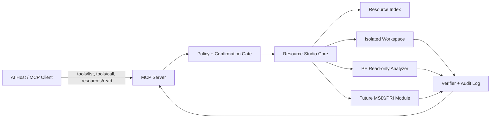

# معمارية MCP في Resource Studio

**الحالة:** معتمدة كأساس تصميمي أولي  
**إصدار الوثيقة:** 0.1.0  
**بروتوكول MCP المستهدف:** `2026-07-28`

## 1. الهدف

يتيح MCP لعملاء الذكاء الاصطناعي اكتشاف موارد Resource Studio وأدواته واستدعاءها وفق عقد قياسي. لا يحتوي خادم MCP على منطق تعديل مستقل؛ بل يستدعي نواة العمليات نفسها التي تستخدمها الواجهة وCLI، حتى تكون النتائج والسجلات والاختبارات متطابقة بين القنوات.

## 2. المكونات



## 3. مسارات التشغيل

| المسار | الاستخدام | الحالة الأمنية |
|---|---|---|
| `stdio` محلي | الاستخدام على جهاز المستخدم مع ملفات محلية | المسار الافتراضي؛ لا يفتح منفذًا شبكيًا |
| Streamable HTTP محلي | ربط عدة واجهات داخل الجهاز | اختياري؛ يتطلب تحكمًا في الأصل والمصادقة |
| Streamable HTTP بعيد | خادم مركزي أو فريق عمل | مرحلة لاحقة؛ يتطلب OAuth وسياسات وصول وتدقيقًا كاملًا |

يبدأ المشروع بـ `stdio` لأن Resource Studio يتعامل مع ملفات محلية وحساسة، ولأن عدم فتح منفذ يقلل سطح الهجوم. لا يُفعّل النقل البعيد إلا بعد إتمام المصادقة، إدارة الجلسات، تحديد المسارات، واختبارات SSRF وconfused deputy.

## 4. طبقات الخادم

### طبقة البروتوكول

تتعامل مع دورة MCP، التفاوض على الإصدار، اكتشاف الأدوات والموارد، الترقيم، الإشعارات، ومخططات JSON. لا تعرف تفاصيل PE ولا تستدعي النظام مباشرة.

### طبقة السياسة

تقرر ما إذا كان الطلب قراءة أو تخطيطًا أو تعديلًا، وتطبق المسارات المسموحة، حجم الملف، نوع العملية، الحاجة إلى التأكيد، ومبدأ أقل صلاحية. كل طلب تعديل يحصل على `planId` و`confirmationToken` قصير العمر ولا يقبل إعادة استخدامه.

### طبقة النواة

تنفذ الفهرسة، المقارنة، التخطيط، النسخ المعزول، استدعاء المحرك الاختياري، وإعادة الفتح والتحقق بعد الكتابة. كل عملية تُرجع نتيجة منظمة لا تعتمد على نصوص الواجهة.

### طبقة المحركات

تشمل محلل موارد Win32، ومحللات الأنواع المعروفة، ومحلل PE للقراءة فقط، ووحدة MSIX/PRI المستقبلية. يمكن إضافة محرك جديد دون تغيير عقد MCP العام.

## 5. دورة عملية تعديل نموذجية

```text
inspect -> diff -> plan -> confirm -> apply_to_workspace -> verify -> export
```

لا يسمح الخادم باستدعاء `apply` مباشرة من مسار غير مخطط. يجب أن يشير الطلب إلى خطة محفوظة، وأن يطابق هاش المصدر، وأن يكون مسار الناتج خارج مسارات الأصل المحمية. بعد التنفيذ يعاد فهرسة الناتج وتُقارن النتائج بالخطة.

## 6. التوافق والتطور

تُدار نسخ MCP وفق صيغة البروتوكول الرسمية. أما أدوات Resource Studio فتملك إصدارًا مستقلًا، مثل `resource_studio.tools.v1`. الإضافة المتوافقة تضيف أداة جديدة أو حقولًا اختيارية؛ التغيير الكاسر ينشئ namespace جديدًا أو إصدارًا رئيسيًا جديدًا. تبقى الأدوات القديمة متاحة خلال فترة انتقال موثقة.

## 7. المراجع الرسمية

[1]: [MCP Introduction](https://modelcontextprotocol.io/docs/2026-07-28/getting-started/intro) — تعريف MCP وأدوار الخادم والعميل.

[2]: [MCP Tools Specification](https://modelcontextprotocol.io/specification/2026-07-28/server/tools) — `tools/list` و`tools/call` والمخططات والتأكيد البشري.

[3]: [MCP Security Best Practices](https://modelcontextprotocol.io/docs/2026-07-28/tutorials/security/security_best_practices) — تقليل الصلاحيات وSSRF وconfused deputy وأمان الخوادم المحلية.

[4]: [MCP Versioning](https://modelcontextprotocol.io/docs/2026-07-28/learn/versioning) — التفاوض وإدارة الإصدارات.
